# Prometheus-Grafana-Monitoring

## Set Up Portainer 
- We can also do this by simply createing a docker-compose.yml file, but here I am using Portainer.
- For using portainer, we have to create a volume for portainer named `portainer_data`  
- And start a container, with the image `portainer/portainer-ee`
- For linux, follow this link
https://docs.portainer.io/start/install/server/docker/linux

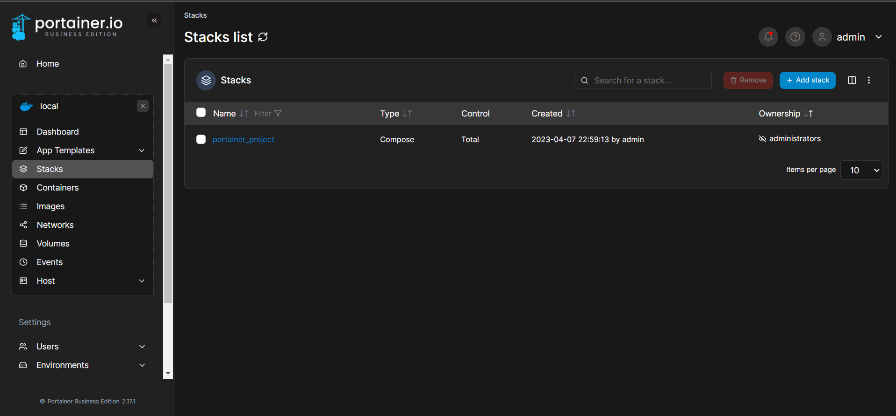

- Now click on `Add stack` to create a new stack.
- Now the stack is actually a docker-compose file which will the containers for all jobs like Prometheus, Grafana, github_exporter, node_exporter etc.
- We have two volumes for grafana and prometheus for storing all the data

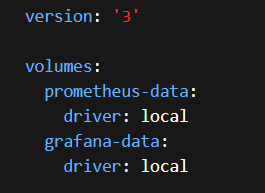

- Now, we have to configure prometheus and grafana.
- You can checkout the boilerplates for this from https://github.com/ChristianLempa/boilerplates under the docker-compose folder.
- You can import a docker-compose file or write it manually here.

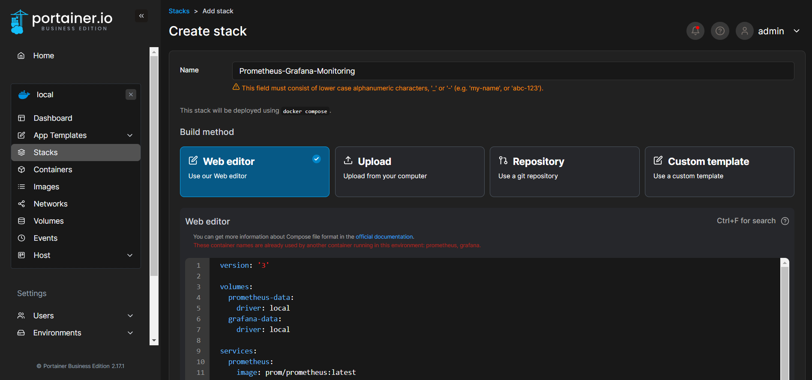

- Similarly do this for node_exporter and github_exporter and click on `Deploy the stack`.
- We also have to write the configuration file `prometheus.yml` which will have all the jobs.
- `sudo mkdir /etc/prometheus`, `cd /etc/prometheus` and `sudo vim prometheus.yml`.

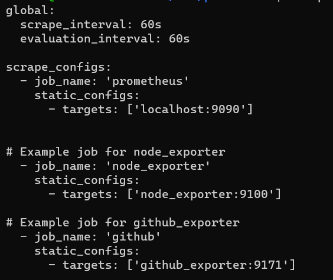

- And here we can see all the containers running.

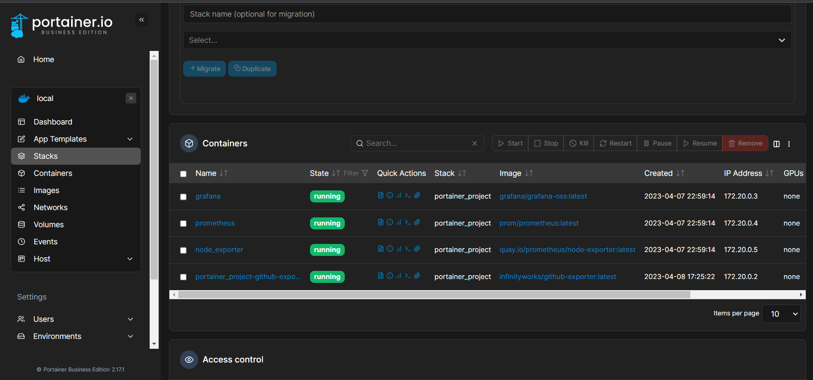

- If you use docker dektop, you can see these containers there too.

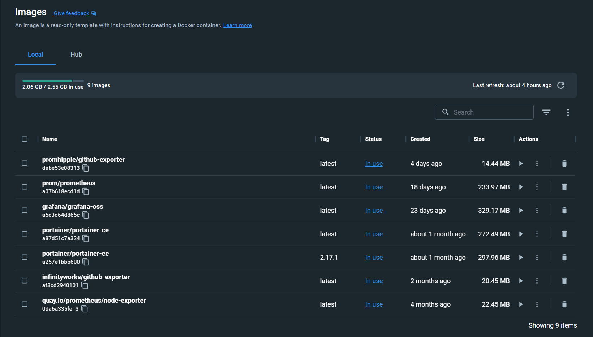
- Now, go ahead to the respective URLs for accessing them on browser.
- Prometheus: `http://localhost:9090`
- Grafana: `http://localhost:3000`
- github_exporter: `http://localhost:9717`

## Prometheus
- On prometheus, click on `status>targets`, which are actually the targets from where prometheus will gather all the metrics.

 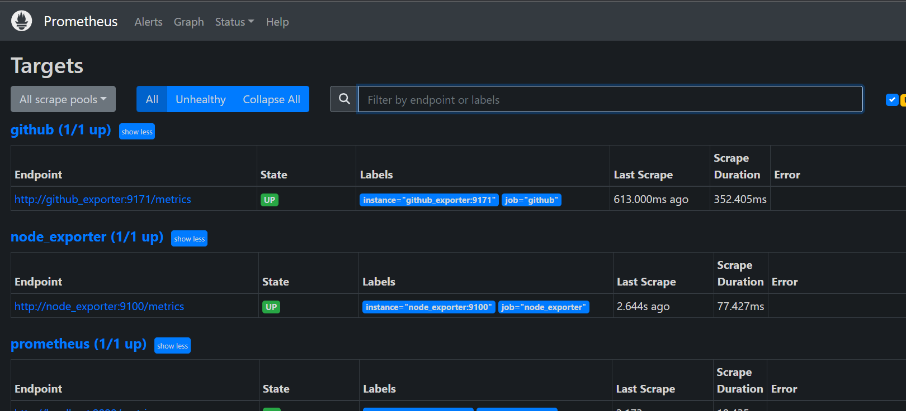

## Grafana
- On localhost:3000, you can access grafana's GUI.
- First step is to select a data source from which all the mtrics will be recieved which in our case is prometheus.

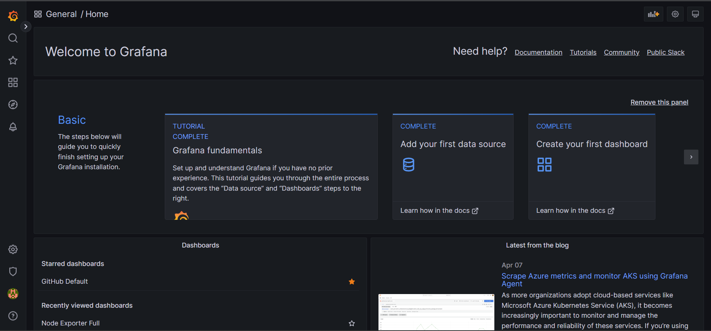
- Select `Prometheus` from the list and enter the URL from where we can access it i.e. `http://prometheus:9090` as on the portainer the name of the container is prometheus.

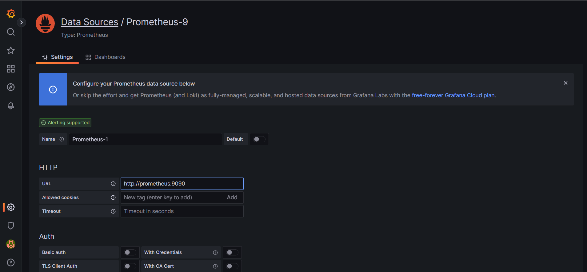

- After this `save and test`
- Now we have a data source named `Prometheus-1`

## Monitor the Server using Node_Exporter

- Now lets import a dashboard
- I have used this dashboard https://grafana.com/grafana/dashboards/1860-node-exporter-full/.
- Copy the ID
- Now on the left most side on grafana, under dashboards select import.
- Enter the Id and `load`.
- After this slect a data-source from the drop down and import.

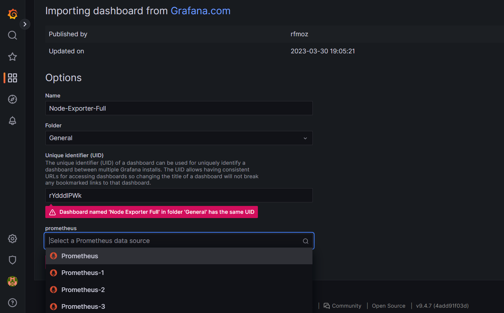

- You will be redirected to this beautiful dashboard.

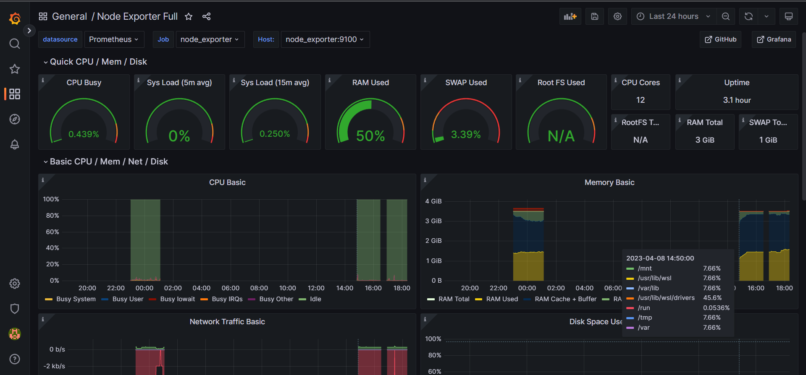
- Now you can alter this according to you.

## Gathering metrics for the github repo

- Next is using the github_exporter https://github.com/infinityworks/github-exporter whose syntax is:

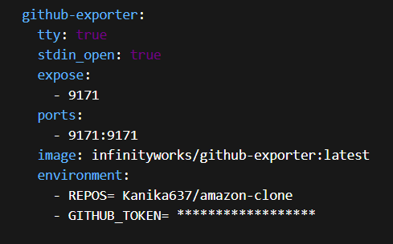

- For the `REPOS` I have given a repo which I want to monitor.
- Also, generate a personal token for yourself from github and make sure you select the `classic` one and not the `fine grained`.
- Now `update the stack` and move to port `9717`.

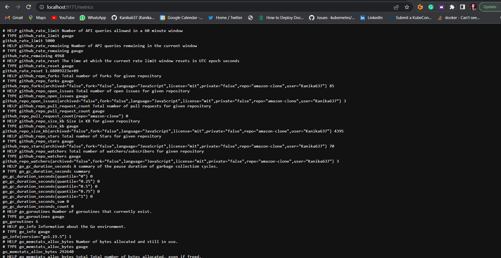

- These are all the metrics for the given repo `Kanika637/amazon-clone`.

## Using the dashboard for monitring the github repos

- For this we have to create a data source just like we did for prometheus.
- Choose `Github` from the list and enter the personal access token as asked ans then save and test.

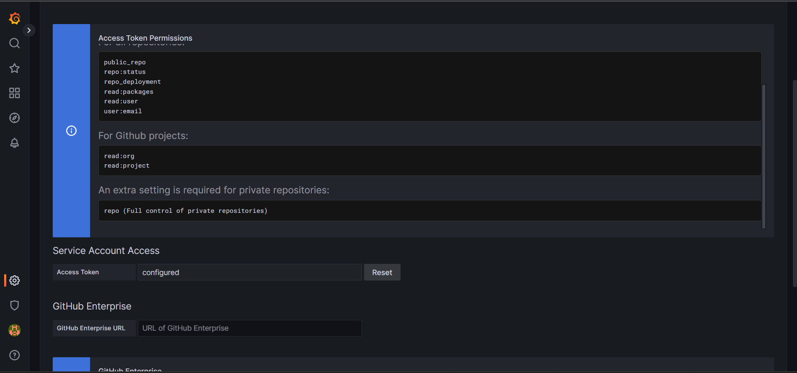

- For this I am using this dashboard https://grafana.com/grafana/dashboards/14000-github-default/ and copy the ID.
- Now doing the same thing, import another dashbaord and enter the Id.
- Next, choose the data-source as GitHub and import.

- Now select the `organisation`, here it is `Kanika637`.
- The `Repository` is `amazon-clone`.
Now you can later it according to you like, the duration for which yoy want the mterics for e.g. last 6 months, last 1hr etc.

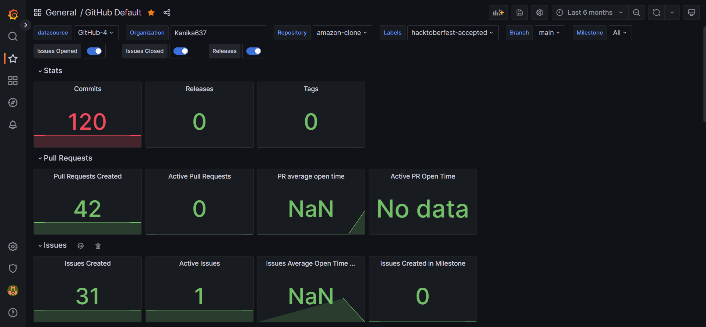

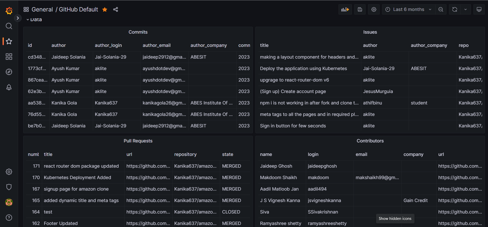

- Here I have this for last 6 months.
- I have all the information like `issues`, `commits`, `contributors` etc.
- And we can do a lot different things.

